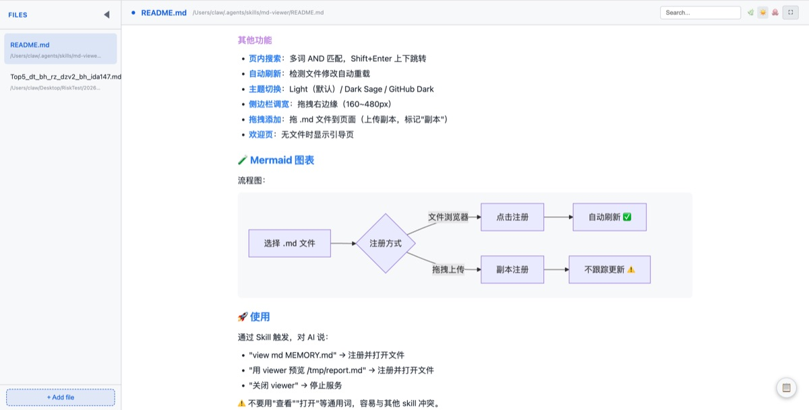

# 🧰 Public Agent Skills

公开的 AI Agent Skills 合集，每个 Skill 都是独立可用的功能模块。

## 📂 Skills 目录

### 🔧 工具类

<table>
<tr>
  <th width="120">Skill</th>
  <th width="240">说明</th>
  <th>关键特性</th>
</tr>
<tr>
  <td><a href="./md-viewer/">md-viewer</a></td>
  <td><b>✨ 给 Markdown 开扇窗</b> 本地 Markdown 文件浏览器</td>
  <td>GFM 渲染、Mermaid 图表、目录导航、图片放大、文件浏览、自动刷新、主题切换 </td>
</tr>
</table>

### 📊 数据类

> 持续更新中…

### 🤖 自动化类

> 持续更新中…

---

## 📌 使用方式

每个 Skill 目录内含 `SKILL.md`，可直接用于 OpenClaw 等 Agent 框架。具体安装方式见各 Skill 的 README。

---
