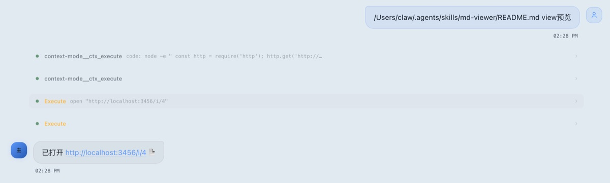
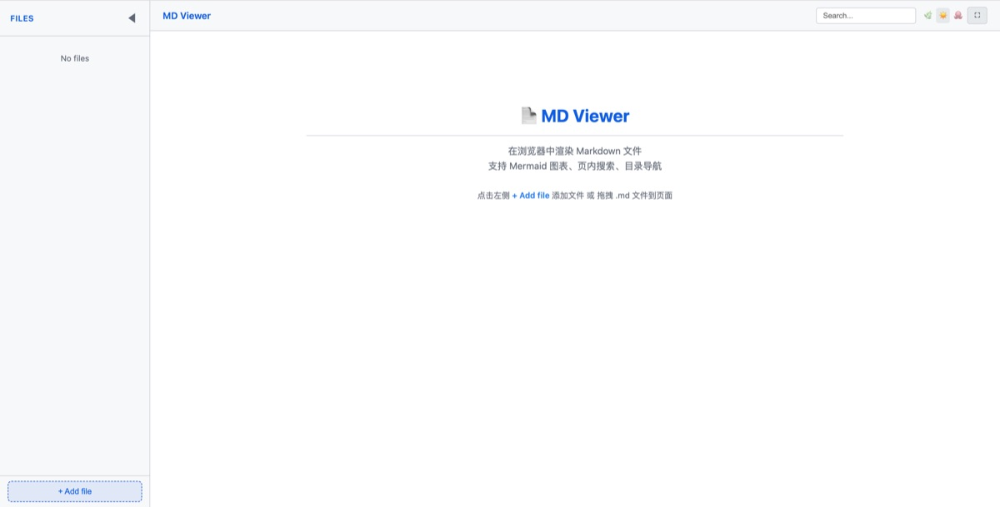
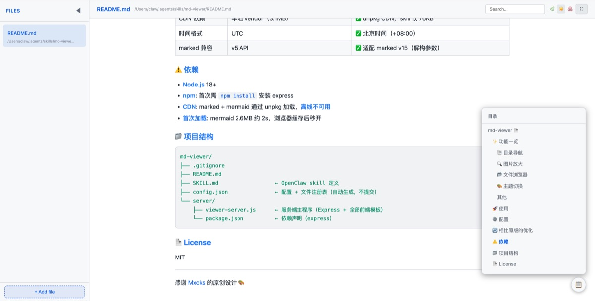
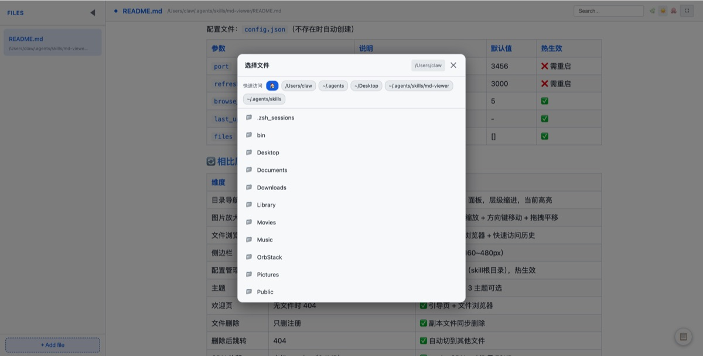
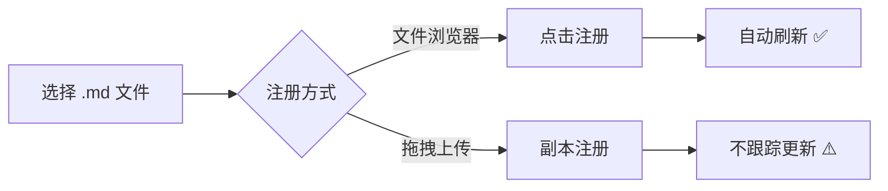

# MD-Viewer-SKILL

本地 Markdown 文件浏览器，支持 Mermaid 图表、目录导航、图片放大、文件浏览。

> 🙏 本项目基于 [Mxcks/md-viewer-skill](https://github.com/Mxcks/md-viewer-skill) 创意开发，尊重原作者的设计思路和劳动成果。在此基础上进行了大量功能增强和架构优化。

## 💬 作者说

谁能想到 Markdown 才是编程语言的究极归宿。

原本只是笔记的载体，如今 SKILL.md 更是将其发扬光大

AI Agent 的灵魂就写在 Markdown 里。Markdown 有了，但**渲染 Markdown 才是关键**。

怎么优雅地阅读 Markdown 文件？下载 Typora、Notion、Obsidian？都太重了。杀鸡焉用牛刀。

**HTML 才是 Markdown 最好的渲染方式。** 即用即走，无需安装臃肿的客户端

图片和 Mermaid 图表的处理非常优雅，前端已经被大模型蚕食得所剩无几——要什么功能，加就完事。

MD-Viewer 的定位很明确：

- ✅ **渲染 Markdown，专心阅读**
- ❌ **不能编辑，不能修改**

修改的事交给大模型。各种Agent/Claw，它改就好了。能吵吵，绝不动手自己改——前提是 Token 够够的。


## ✨ 功能一览

使用方法



HTML地址 : http://localhost:3456/i/4


| | |
|---|---|
|  <br/> **主界面** — 左侧文件列表 + 右侧渲染内容 |  <br/> **目录导航** — 右下角 📋 按钮，h1~h4 层级，点击跳转 |
|  <br/> **图片放大** — 全屏查看，按钮缩放，方向键移动 |  <br/> **文件浏览器** — 目录浏览 + 快速访问历史 |

### 其他功能

- **页内搜索**：多词 AND 匹配，Shift+Enter 上下跳转
- **自动刷新**：检测文件修改自动重载
- **主题切换**：Light（默认）/ Dark Sage / GitHub Dark
- **侧边栏调宽**：拖拽右边缘（160~480px）
- **拖拽添加**：拖 .md 文件到页面（上传副本，标记"副本"）
- **欢迎页**：无文件时显示引导页

## 🧪 Mermaid 图表

流程图：




## 🚀 使用

通过 Skill 触发，对 AI 说：

- "view md MEMORY.md" → 注册并打开文件
- "用 viewer 预览 /tmp/report.md" → 注册并打开文件
- "关闭 viewer" → 停止服务

⚠️ 不要用"查看""打开"等通用词，容易与其他 skill 冲突。

首次使用需安装依赖：`cd $SKILL_DIR/server && npm install`

详细命令见 [SKILL.md](SKILL.md)。

## ⚙️ 配置

配置文件：`config.json`（不存在时自动创建）

| 参数 | 说明 | 默认值 | 热生效 |
|------|------|--------|--------|
| `port` | 服务端口 | 3456 | ❌ 需重启 |
| `refresh_interval` | 自动刷新间隔（毫秒） | 3000 | ❌ 需重启 |
| `browse_history_limit` | 快速访问历史条数 | 5 | ✅ |
| `last_updated` | 最后更新时间 | - | ✅ |
| `files` | 已注册文件列表 | [] | ✅ |

## 🔄 相比原版的优化

| 维度 | 原版 | 本版 |
|------|------|------|
| 目录导航 | ❌ | ✅ 右下角 TOC 面板，层级缩进，当前高亮 |
| 图片放大 | ❌ | ✅ 全屏 + 按钮缩放 + 方向键移动 + 拖拽平移 |
| 文件浏览 | 拖拽/路径输入 | ✅ 服务端目录浏览器 + 快速访问历史 |
| 侧边栏 | 固定宽度 | ✅ 拖拽调宽（160~480px） |
| 配置管理 | viewer-manifest.json（server内） | ✅ config.json（skill根目录），热生效 |
| 主题 | Dark Sage 默认 | ✅ Light 默认，3 主题可选 |
| 欢迎页 | 无文件时 404 | ✅ 引导页 + 文件浏览器 |
| 文件删除 | 只删注册 | ✅ 副本文件同步删除 |
| 删除后跳转 | 404 | ✅ 自动切到其他文件 |
| CDN 依赖 | 本地 vendor（3.1MB） | ✅ unpkg CDN，skill 仅 76KB |
| 时间格式 | UTC | ✅ 北京时间（+08:00） |
| marked 兼容 | v5 API | ✅ 适配 marked v15（解构参数） |
| 中文路径图片 | ❌ | ✅ 修复 res.sendFile 编码问题 |

## ⚠️ 依赖

- **Node.js** 18+
- **npm**: 首次需 `npm install` 安装 express
- **CDN**: marked + mermaid 通过 unpkg 加载，**离线不可用**
- **首次加载**: mermaid 2.6MB 约 2s，浏览器缓存后秒开

## 📁 项目结构

```
md-viewer/
├── .gitignore
├── README.md
├── SKILL.md                  ← OpenClaw skill 定义
├── config.json               ← 配置 + 文件注册表（自动生成，不提交）
└── server/
    ├── viewer-server.js      ← 服务端主程序（Express + 全部前端模板）
    └── package.json          ← 依赖声明（express）
```

---

感谢 [Mxcks](https://github.com/Mxcks) 的原创设计 🎨
